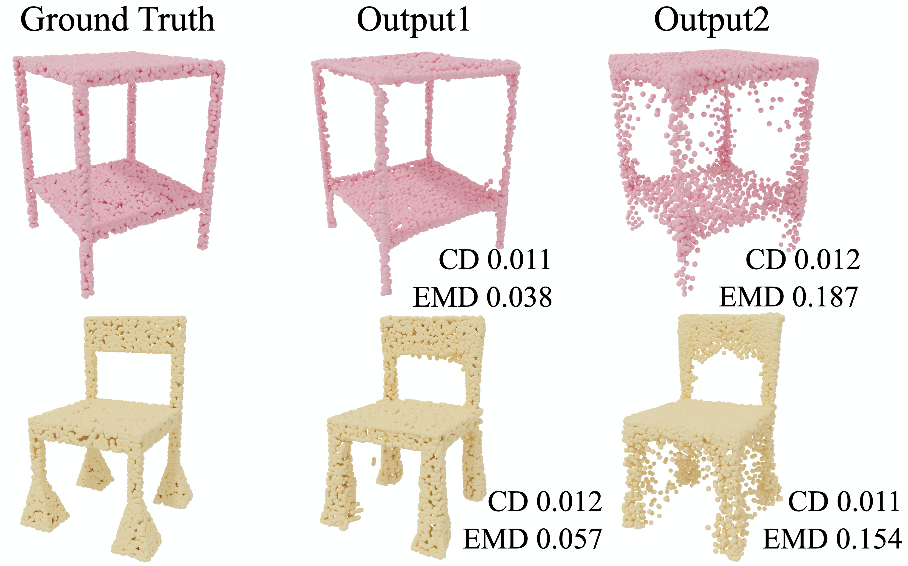

## Earth Mover's Distance of point clouds



This project is based on https://github.com/Colin97/MSN-Point-Cloud-Completion.

Compared to the Chamfer Distance (CD), the Earth Mover's Distance (EMD) is more reliable to distinguish the visual quality of the point clouds. See our [paper](https://arxiv.org/abs/1707.02392) for more details. 

We provide an EMD implementation for point cloud comparison, which only needs $O(n)$ memory and thus enables dense point clouds (with 10,000 points or over) and large batch size. It is based on an approximated algorithm (auction algorithm) and cannot guarantee a (but near) bijection assignment. It employs a parameter $\epsilon$ to balance the error rate and the speed of convergence. Smaller $\epsilon$ achieves more accurate results, but needs a longer time for convergence. The time complexity is $O(n^2k)$, where $k$ is the number of iterations. We set a $\epsilon = 0.005, k = 50$ during training and a $\epsilon = 0.002, k = 10000$ during testing. 

### Compile
Run `python3 setup.py install` to compile.

### Example
See `test/test_EMDModule.py` for examples.

### Useage
```python
from EMD_module.emd_module import EMDModule

x1 = torch.rand(20, 8192, 3).cuda()  # please normalize your point cloud to [0, 1]
x2 = torch.rand(20, 8192, 3).cuda()
emd = EMDModule()
start_time = time.perf_counter()
dis, assigment = emd(x1, x2, 0.002, 10000)  # 0.005, 50 for training
```

### Input

- **xyz1, xyz2**: float tensors with shape `[#batch, #points, 3]`. xyz1 is the predicted point cloud and xyz2 is the ground truth point cloud. Two point clouds should have same size and be normalized to [0, 1]. The number of points should be a multiple of 1024. The batch size should be no greater than 512. Since we only calculate gradients for xyz1, please do not swap xyz1 and xyz2.
- **eps**: a float tensor, the parameter balances the error rate and the speed of convergence.
- **iters**: a int tensor, the number of iterations.

### Output

- **dist**: a float tensor with shape `[#batch, #points]`. sqrt(dist) are the L2 distances between the pairs of points.
- **assignment**: a int tensor with shape `[#batch, #points]`. The index of the matched point in the ground truth point cloud.
